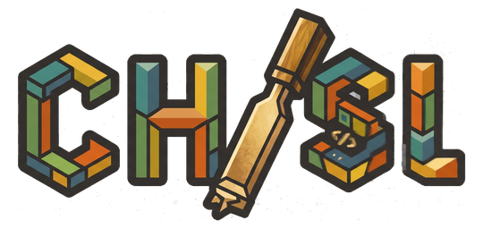
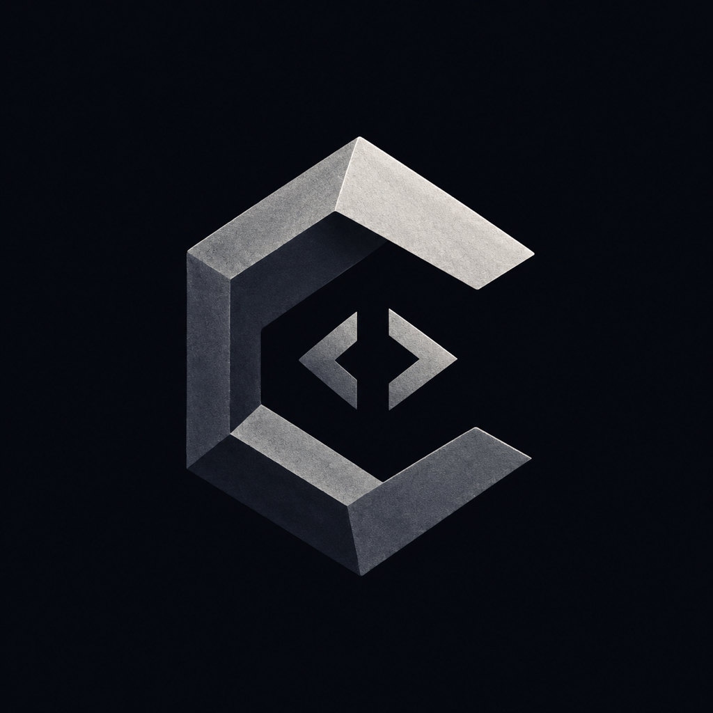

<p align="center">
  
</p>

<p align="center">
  <strong>A desktop interface forge for remote headless OpenCode servers and local coding agents.</strong>
</p>

<p align="center">
  
</p>

<p align="center">
  <a href="LICENSE"></a>
  
  
  
  
</p>

<p align="center">
  <strong>Chisl palette</strong><br />
  
  
  
  
  
</p>

---

## What Chisl Does

Chisl gives coding agents a durable desktop interface. Run the agent environment on the machine that has your repositories, terminals, credentials, and tools; then drive it from the Chisl desktop client.

The primary target is **desktop client to remote headless OpenCode server** usage. Chisl turns a remote OpenCode server into a richer command center with chat, workspace files, permission handling, mode switching, model visibility, and persistent session context.

It also supports local agent workflows for:

| Agent          | Typical use                                                      |
| -------------- | ---------------------------------------------------------------- |
| OpenCode local | Run OpenCode directly on the current machine.                    |
| Claude Code    | Work with Claude Code sessions from the same Chisl interface.    |
| Gemini CLI     | Start and continue Gemini CLI-backed coding sessions.            |
| Codex          | Use Codex sessions with workspace, tool-call, and permission UI. |

## Why It Exists

Terminal-first coding agents are powerful, but raw terminals are not enough once you want to run them all day, from multiple devices, across multiple repositories.

Chisl adds the missing interface layer:

| Problem                                                         | Chisl answer                                                                            |
| --------------------------------------------------------------- | --------------------------------------------------------------------------------------- |
| Agents run on a remote box, but terminals are a thin interface. | A desktop client connected to the remote headless OpenCode server.                      |
| Terminal output is hard to inspect later.                       | Persistent conversations, grouped history, streaming messages, and searchable sessions. |
| Tool calls and permission prompts need supervision.             | Dedicated permission, tool-call, and confirmation UI.                                   |
| Agents edit files, but you need context.                        | Workspace browser, file picker, code/markdown/diff/image previews, and file mentions.   |
| Different CLIs have different modes and model surfaces.         | One control plane for modes, models, messages, and session metadata.                    |
| You want to extend the interface.                               | Extension hooks for agents, tools, skills, themes, and settings.                        |

## Product Model

### Desktop Client First

Chisl is a desktop product first. The intended primary setup is a Chisl desktop client connected to a remote, headless OpenCode server running near your code.

Use it when you want:

| Goal                                       | Result                                                                  |
| ------------------------------------------ | ----------------------------------------------------------------------- |
| Keep OpenCode running near your code.      | The remote server has access to the workspace, credentials, and tools.  |
| Use a real interface instead of a raw TTY. | The desktop client provides chat, files, previews, modes, and prompts.  |
| Work across multiple repositories.         | Chisl keeps sessions organized by workspace and agent.                  |
| Supervise agent actions clearly.           | Permission prompts and tool calls get dedicated UI instead of log spam. |

### Remote Headless OpenCode Server

The remote OpenCode server is where agent execution happens. It should live on the workstation, VM, or development box that can see the repositories and run the CLI tooling.

Chisl is the control surface for that server:

| Capability             | Notes                                                                                  |
| ---------------------- | -------------------------------------------------------------------------------------- |
| Remote session control | Start, continue, stop, and inspect remote OpenCode sessions.                           |
| Conversation workspace | Chat, stream responses, inspect tool calls, stop runs, and continue history.           |
| File context           | Attach files, mention files, browse workspaces, and preview generated or edited files. |
| Mode control           | Switch supported OpenCode modes from the desktop UI.                                   |
| Display control        | Switch between Gruvbox and Chisl color schemes, light/dark mode, and custom CSS.       |

### Local Agent Support

Local agents are supported, but they are not the main product shape. Use local Claude Code, OpenCode, Gemini CLI, or Codex when you want Chisl to front a CLI on the same machine as the desktop app.

## Agent Workflows

### OpenCode Remote First

Chisl is optimized around OpenCode running remotely. The headless server stays close to the repository and OpenCode runtime; the desktop UI can be somewhere else.

Remote OpenCode sessions get the richer parts of the interface:

| Feature                   | What it means                                                          |
| ------------------------- | ---------------------------------------------------------------------- |
| Remote session continuity | Continue work without tying the UI to one terminal window.             |
| Build/plan mode control   | Switch OpenCode modes from the UI where supported.                     |
| Model metadata            | Show the model/provider reported by the remote session when available. |
| Slash-command support     | Surface OpenCode command affordances where the session supports them.  |
| Workspace file context    | Add files and browse the remote workspace through the Chisl interface. |

### Local CLI Agents

Chisl also works as a local front-end for supported CLI agents. Install and authenticate the CLI you want to use, then select it in Chisl when starting a session.

Supported local workflows currently include:

| Workflow       | Notes                                                                   |
| -------------- | ----------------------------------------------------------------------- |
| Claude Code    | Uses your local Claude Code setup and permissions.                      |
| OpenCode local | Runs OpenCode on the same machine as Chisl.                             |
| Gemini CLI     | Uses Gemini CLI-backed sessions and Gemini-oriented modes.              |
| Codex          | Uses Codex sessions with Chisl's conversation and permission interface. |

## Core Features

| Feature                  | Description                                                              |
| ------------------------ | ------------------------------------------------------------------------ |
| Multi-agent entry point  | Choose from remote OpenCode and supported local CLIs from one interface. |
| Persistent conversations | Keep session history organized by workspace and agent.                   |
| Streaming chat           | Watch agent output as it happens and stop active runs when needed.       |
| Permission handling      | Review and answer confirmations without digging through terminal output. |
| Tool-call summaries      | Inspect what the agent is doing at a higher level.                       |
| Workspace browser        | Browse directories, read files, preview images, and inspect diffs.       |
| File mentions            | Add precise file context to prompts from the workspace.                  |
| Model and mode controls  | Adjust supported agent modes and view model/provider information.        |
| MCP tools and skills     | Add tool servers and reusable skills for agent workflows.                |
| Extensions               | Contribute agents, adapters, tools, themes, and settings tabs.           |
| Channels                 | Connect supported messaging channels for assistant interactions.         |
| Themes                   | Use the warm Chisl palette, Gruvbox, dark/light mode, or custom CSS.     |

## Branding

The README uses the same in-repo brand assets as the application.

| Asset         | Path                                                                 |
| ------------- | -------------------------------------------------------------------- |
| Wordmark      | `packages/desktop/src/renderer/assets/logos/brand/wordmark.png`      |
| App mark      | `packages/desktop/src/renderer/assets/logos/brand/app.png`           |
| Gray wordmark | `packages/desktop/src/renderer/assets/logos/brand/wordmark-gray.png` |
| Packaged icon | `resources/app.png`                                                  |
| PWA icons     | `public/pwa/icon-192.png`, `public/pwa/icon-512.png`                 |

The Chisl color scheme is a muted retro palette sampled from the logo and wordmark.

| Role              | Light     | Dark      |
| ----------------- | --------- | --------- |
| Rust primary      | `#b4480c` | `#e07820` |
| Parchment surface | `#f0e4b4` | `#28241d` |
| Ink text          | `#303024` | `#ecdfb6` |
| Olive success     | `#607848` | `#8aa860` |
| Gold warning      | `#c08418` | `#e4b430` |
| Slate info        | `#3c786c` | `#6caa9c` |

## Quick Start

### Requirements

| Requirement         | Notes                                                                                                    |
| ------------------- | -------------------------------------------------------------------------------------------------------- |
| Node.js             | `>=22 <25`                                                                                               |
| Bun                 | Used for install and project scripts.                                                                    |
| Supported agent CLI | Install and authenticate OpenCode, Claude Code, Gemini CLI, or Codex depending on the workflow you want. |
| Remote access       | For remote use, run Chisl where the repositories and agent CLI credentials live.                         |

Install dependencies:

```bash
bun install
```

Run the desktop app:

```bash
bun run dev
```

Build the app:

```bash
bun run package
```

## Useful Commands

| Command                | Purpose                                    |
| ---------------------- | ------------------------------------------ |
| `bun run dev`          | Start the desktop app in development mode. |
| `bun run package`      | Build app output.                          |
| `bun run dist`         | Create packaged desktop artifacts.         |
| `bun run lint`         | Run lint checks.                           |
| `bun run format:check` | Check formatting.                          |
| `bunx tsc --noEmit`    | Type-check.                                |
| `bun run test`         | Run tests.                                 |

## Development Checks

Before opening or pushing changes, the most useful local checks are:

```bash
bun run lint
bun run format:check
bunx tsc --noEmit
bun run test
```

If you change user-facing text or locale files, also run:

```bash
bun run i18n:types
node scripts/check-i18n.js
```

## Documentation

| Topic                | Path                                  |
| -------------------- | ------------------------------------- |
| Contributor guide    | `CONTRIBUTING.md`                     |
| Development setup    | `docs/contributing/development.md`    |
| File structure rules | `docs/contributing/file-structure.md` |
| Server deployment    | `docs/guides/deploy-server.md`        |

## Status

Chisl is moving quickly. The current center of gravity is remote OpenCode operation with a desktop client on top, while local Claude Code, OpenCode, Gemini CLI, and Codex workflows remain supported.

Expect some internal names, package metadata, and environment variables to lag behind the Chisl branding while the product surface stabilizes.

## License

Licensed under [Apache-2.0](LICENSE).
