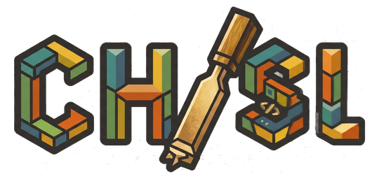

<p align="center">
  
</p>

<p align="center">
  <strong>A desktop interface forge for OpenCode remote agents and local coding-agent CLIs.</strong>
</p>

<p align="center">
  
</p>

<p align="center">
  <a href="LICENSE"></a>
  
  
  
  
</p>

<p align="center">
  <strong>Chisl palette</strong><br />
  
  
  
  
  
</p>

---

## What Chisl Does

Chisl is a desktop client for driving coding agents through a durable UI instead of a raw terminal. Its primary path is connecting to a registered **OpenCode remote agent**, and it also drives local CLI-backed agents. Project files, secrets, and tools come from whatever agent runtime and MCP connectors you configure — Chisl doesn't lock you into a layout.

Supported agents:

| Workflow              | What Chisl exposes                                                                                                                                                                               |
| --------------------- | ------------------------------------------------------------------------------------------------------------------------------------------------------------------------------------------------ |
| OpenCode remote agent | Register a remote endpoint, test/handshake it, fetch model metadata, send messages, attach files, use OpenCode modes, slash commands, stop active runs, and inspect context usage when reported. MCP servers and skills are configured on the OpenCode server side; Chisl surfaces their output in the conversation. |
| OpenCode local        | Use a detected local OpenCode-style agent from the same chat interface.                                                                                                                          |
| Claude Code           | Use detected Claude Code sessions through the local-agent flow.                                                                                                                                  |
| Gemini CLI            | Use Gemini CLI-backed sessions and Gemini modes.                                                                                                                                                 |
| Codex                 | Use Codex sessions with Chisl conversation, tool-call, and permission UI.                                                                                                                        |
| Custom local agent    | Define an ACP-style command, args, env, icon, and advanced settings from the Agent settings page.                                                                                                |

## Features

| Capability              | What you can do                                                                                                                                                      |
| ----------------------- | -------------------------------------------------------------------------------------------------------------------------------------------------------------------- |
| Remote agent registry   | Add, edit, delete, and list remote agents — name, protocol, URL, auth (token or basic), avatar, description, insecure-TLS toggle — and test/handshake before saving. |
| Model selection         | Refresh and pick from the models a connected OpenCode server advertises.                                                                                             |
| Unified agent picker    | Remote agents sit alongside detected local agents on the start page.                                                                                                 |
| Chat & context          | Send prompts with attached files and selected workspace items; see token/context usage when the agent reports it.                                                    |
| Command queue           | Queue, reorder, pause, resume, edit, remove, or clear prompts while a run is busy.                                                                                   |
| Run control             | Stop an active run, switch OpenCode modes, attach server-side skills (sticky across messages), and use slash commands.                                               |
| Session actions         | Fork, revert/restore, share/unshare a link, summarize/compact, and edit the server config from the conversation header. View file changes via the Interactive Diff workspace tab: revert individual hunks or whole files, and browse native workspace VCS diffs for any remote session regardless of tool-host mode. |
| Compaction              | Get notified (with tokens reclaimed) when a session is compacted, manually or automatically.                                                                         |
| Server-state pills      | See the connected server (with one-click switch) and tool-host mode; in server-tool-host mode, LSP status and VCS branch/changes too.                                |
| Multi-server            | Live per-agent health in settings and a default-server preference.                                                                                                   |
| Permissions & approvals | Approve tool and question requests via per-request cards, a pending banner, and a dedicated Approvals tab, including bulk approve. An auto-approval rule evaluator runs each incoming prompt against your saved allow/deny rules and responds automatically, with session-scoped rules visible in the conversation History tab. A protected-paths hard-deny layer blocks credential and SSH key paths regardless of allow rules. Shell-command cards include an "Edit and Resend" action that rejects the original and resubmits a modified command. |
| Sub-agents              | Watch delegated child sessions as inline, collapsible subtask cards.                                                                                                 |
| Message editing         | Edit or delete your own messages in a remote conversation.                                                                                                           |
| Local & custom agents   | Use detected local CLIs (Claude Code, Gemini CLI, Codex, local OpenCode), or define your own ACP-style command agent.                                                |
| Editor & LSP            | Monaco editor with LSP-powered go-to-definition, peek references, rename symbol, and quick fix; Emmet abbreviation expansion for HTML, CSS, JSX, and TSX; git change indicators on the minimap and overview ruler; inline and side-by-side diff review for agent conflicts. |
| Settings & Layout       | Dedicated Settings shell with a full-width nav column below the titlebar; main workspace sider hides on settings routes. Responsive single-bar header chrome collapses ambient badges into an overflow menu on narrow viewports. |
| Appearance              | Ships with Chisl's retro palette; a toggle hands control to a CSS theme preset (Catppuccin included).                                                                |

## Remote OpenCode Flow

Configure the remote OpenCode path as a remote-agent entry in Agent settings.

| Step                 | What happens                                                                                                                                                                          |
| -------------------- | ------------------------------------------------------------------------------------------------------------------------------------------------------------------------------------- |
| Register endpoint    | Add a remote agent with protocol `opencode`, a URL, an auth type, and an optional token/password.                                                                                     |
| Test connection      | The settings modal can test the endpoint before you save.                                                                                                                             |
| Save and handshake   | Saving an OpenCode remote agent runs a handshake.                                                                                                                                     |
| Select in chat       | The agent shows up in the start-page picker alongside your local agents.                                                                                                              |
| Fetch models         | Refresh the model list the server advertises.                                                                                                                                         |
| Chat                 | Send prompts, attaching files and selected workspace items as needed.                                                                                                                 |
| Control the run      | Stop a run, queue more prompts, switch modes, attach skills.                                                                                                                          |
| Manage the session   | Fork, revert/restore, share/unshare, summarize/compact, view file changes, or edit the server config from the conversation header.                                                    |
| Inspect server state | In server-tool-host mode, header pills show the connected server (with quick-switch), LSP status, and VCS branch/changes; permission and question prompts route to the Approvals tab. |

## Local Agent Flow

Local CLI-backed agents are a secondary path.

| Feature          | Behavior                                                                                                              |
| ---------------- | --------------------------------------------------------------------------------------------------------------------- |
| Detected agents  | The Agent settings page reads detected local agents and shows them as chat targets.                                   |
| Custom agents    | Users can define a command, args, env, icon, and advanced options for a custom agent.                                 |
| Agent launch     | The start page restores or preselects available agents and routes to conversation creation.                           |
| Modes and models | The start page resolves mode/model metadata from agent config, handshake data, or remote model cache where available. |

## OpenCode Plugin

`@chisl/chisl-opencode-plugin` is the control-plane bridge between a remote OpenCode server and your local Chisl instance. Install it on the OpenCode side to unlock deeper integration.

| Capability          | What it does                                                                                                                                                                                                                  |
| ------------------- | ----------------------------------------------------------------------------------------------------------------------------------------------------------------------------------------------------------------------------- |
| Context injection   | AionCore pushes dynamic system-prompt strings to the plugin over SSE; the plugin injects them into the chat via `experimental.chat.system.transform`, with a defensive synthetic-part fallback.                                |
| Tool audit          | Every `tool.execute.before` / `tool.execute.after` event and a curated set of OpenCode lifecycle events are forwarded to AionCore and stored in a per-agent ring buffer for the renderer-side status panel.                    |
| Streaming shell     | A custom `run_shell_streaming` tool streams command output (stdout and stderr) from AionCore back to the remote OpenCode host over SSE, gated through the same shell approver the local fs MCP uses. Default timeout is 120 s. |
| Permission routing  | OpenCode's `permission.ask` hook dials AionCore for a decision; the MVP policy is `"ask"` passthrough so OpenCode's native flow continues while AionUi shows the prompt in its Approvals queue.                               |

The plugin runs in-process in the OpenCode server. All shell execution happens on the AionCore side, behind the shell approver and audit ring buffer.

Install it from the **Remote Agents** panel in AionUi (click **Install Plugin** on the agent card) or follow the step-by-step instructions in [`docs/opencode-plugin/install-guide.md`](docs/opencode-plugin/install-guide.md).

## Local Filesystem MCP (Data Plane)

`local_fs_mcp` is the data plane for remote OpenCode sessions. Where the OpenCode plugin handles control-plane concerns (context injection, tool audit, permission routing), `local_fs_mcp` handles the actual file I/O and synchronous shell execution, keeping all of that work on the local host (AionCore side) rather than on the remote OpenCode server.

| Capability         | What it does                                                                                                                                                                                  |
| ------------------ | --------------------------------------------------------------------------------------------------------------------------------------------------------------------------------------------- |
| File reads/writes  | Serves file content to the remote OpenCode instance and writes agent-produced changes back to the local filesystem, so the remote server never needs direct disk access.                       |
| Synchronous shell  | Runs shell commands locally on behalf of the remote agent. Every invocation passes through the `ShellApprover` mechanism, which surfaces the request in the Approvals tab before execution.   |
| Snapshot ledger    | Records a per-tool-call snapshot of every file touched during a session. This ledger is what powers the Interactive Diff revert features, letting you roll back individual hunks or whole files. |

The `ShellApprover` gate means no shell command runs silently. You see each request in the Approvals tab, can edit and resend it, or deny it outright. Auto-approval rules apply here the same way they do for other tool calls.

Keeping execution on the AionCore side is a deliberate security boundary: the remote OpenCode process gets file content and command results, but it never holds credentials, SSH keys, or raw filesystem access. The protected-paths hard-deny layer enforces this even if an allow rule would otherwise permit it.

## Branding

Brand assets live in the repo and are shared with the application.

| Asset         | Path                                                                 |
| ------------- | -------------------------------------------------------------------- |
| Wordmark      | `packages/desktop/src/renderer/assets/logos/brand/wordmark.png`      |
| App mark      | `packages/desktop/src/renderer/assets/logos/brand/app.png`           |
| Gray wordmark | `packages/desktop/src/renderer/assets/logos/brand/wordmark-gray.png` |
| Packaged icon | `resources/app.png`                                                  |

The Chisl color scheme is a muted retro palette sampled from the logo and wordmark.

| Role              | Light     | Dark      |
| ----------------- | --------- | --------- |
| Rust primary      | `#b4480c` | `#e07820` |
| Parchment surface | `#f0e4b4` | `#28241d` |
| Ink text          | `#303024` | `#ecdfb6` |
| Olive success     | `#607848` | `#8aa860` |
| Gold warning      | `#c08418` | `#e4b430` |
| Slate info        | `#3c786c` | `#6caa9c` |

## Quick Start

Install dependencies:

```bash
bun install
```

Run the desktop app:

```bash
bun run dev
```

Build the app output:

```bash
bun run package
```

Create packaged desktop artifacts:

```bash
bun run dist
```

## Development Checks

Useful local checks:

```bash
bun run lint
bun run format:check
bunx tsc --noEmit
bun run test
```

## Documentation

| Topic                | Path                                  |
| -------------------- | ------------------------------------- |
| Contributor guide    | `CONTRIBUTING.md`                     |
| Development setup    | `docs/contributing/development.md`    |
| File structure rules | `docs/contributing/file-structure.md` |

## Status

Chisl is under active development.

## License

Licensed under [Apache-2.0](LICENSE).

## Attribution

Chisl is derived from an Apache-2.0 licensed project. Substantial modifications have been made, including changes to branding, UI, workflows, agent integrations, and application behavior.

Original copyright and license notices are preserved in accordance with the Apache License 2.0.

Bundled third-party components (including Monaco Editor, Pierre Diffs, React, and others) are listed in [THIRD_PARTY_NOTICES.md](THIRD_PARTY_NOTICES.md). The desktop app also exposes this file from **Settings → About → Third-party notices**.
